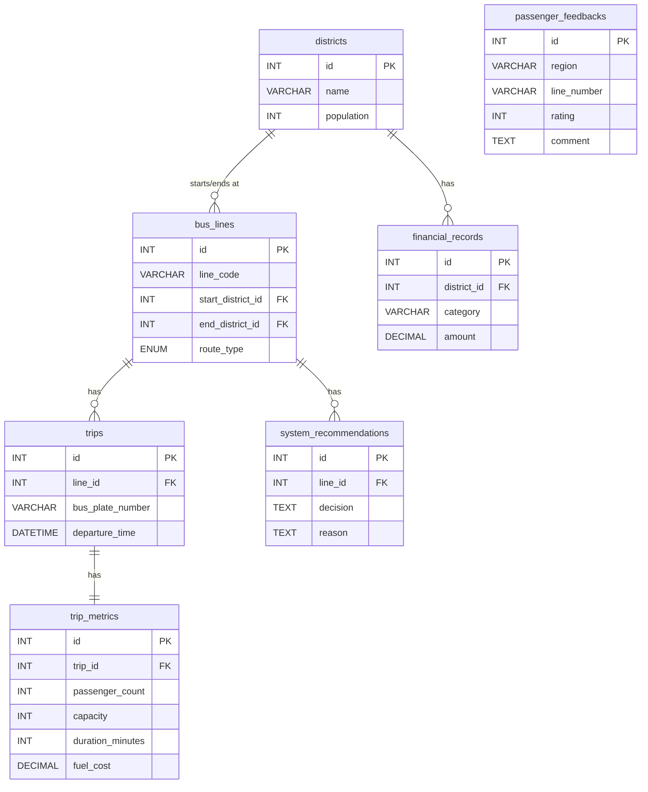

# İstanbul Ulaşım Karar Destek Sistemi (İETT DSS)

Bu proje, İstanbul toplu taşıma verilerini analiz etmek, hat verimliliğini artırmak ve stratejik kararlar almak için geliştirilmiş web tabanlı bir Karar Destek Sistemidir (DSS).

## 🚀 Proje Özellikleri

Proje **MVC (Model-View-Controller)** mimarisi ile geliştirilmiştir ve aşağıdaki temel modülleri içerir:

*   **📊 Yönetici Dashboard:**
    *   Toplam hat, günlük yolcu ve acil müdahale gerektiren durumlar için KPI kartları.
    *   İstanbul ilçelerindeki yolcu yoğunluğunu gösteren interaktif harita (Leaflet.js).
    *   Anlık kritik olay akışı (Sefer iptalleri, kapasite aşımları).
*   **🚌 Hat Analizleri:**
    *   Seferdeki tüm hatların doluluk, süre ve finansal (kâr/zarar) analizi.
    *   Yapay zeka destekli karar önerileri (Örn: "Acil Ek Sefer", "Hattı İptal Et").
    *   Her hat için detaylı saatlik yolcu ve kapasite grafikleri.
*   **♟️ Stratejik Analiz:**
    *   İlçe bazlı stratejik verimlilik tablosu.
    *   "Senaryo Simülatörü": Sefer sıklığı veya bilet fiyatı değişimlerinin gelir ve memnuniyete etkisini simüle eder.
    *   Finansal "Röntgen": Gelir-gider dengesi ve yatırım planlaması.

## 🛠️ Teknolojiler

*   **Backend:** Node.js, Express.js
*   **Veritabanı:** MySQL (mysql2 kütüphanesi ile)
*   **Frontend:** HTML5, CSS3, JavaScript (Vanilla), Bootstrap 5, Chart.js, Leaflet.js
*   **Mimari:** MVC (Model-View-Controller)

## 📂 Proje Yapısı

```
iett_ulasim/
├── app.js              # Sunucu ana giriş dosyası
├── controllers/        # İş mantığı ve veri işleme (Controller katmanı)
├── routers/            # API rotalarının tanımları (Router katmanı)
├── db/                 # Veritabanı bağlantı ayarları ve şema
├── public/             # Statik dosyalar (CSS, JS, Resimler, HTML)
├── views/              # EJS şablonları (Stratejik analiz vb.)
└── scripts/            # Yardımcı araçlar ve veri yükleme scriptleri
```

## 🗄️ Veritabanı Şeması (ER Diyagramı)

Aşağıdaki diyagram, sistemin veritabanı yapısını ve tablolar arasındaki ilişkileri göstermektedir:




## ⚙️ Kurulum ve Çalıştırma

1.  **Gereksinimler:**
    *   Node.js (v14 veya üzeri)
    *   MySQL Veritabanı

2.  **Projeyi İndirin ve Bağımlılıkları Yükleyin:**
    ```bash
    git clone <repo-url>
    cd iett_ulasim
    npm install
    ```

3.  **Veritabanı Kurulumu:**
    *   MySQL üzerinde `iett_ulasim` adında bir veritabanı oluşturun.
    *   `db/schema.sql` dosyasını içe aktararak tabloları oluşturun.
    *   *(Opsiyonel)* `scripts/` klasöründeki seed dosyaları ile örnek veri yükleyebilirsiniz.

4.  **Çevresel Değişkenler (.env):**
    *   Ana dizinde `.env` dosyası oluşturun ve veritabanı bilgilerinizi girin:
    ```env
    DB_HOST=localhost
    DB_USER=root
    DB_PASSWORD=
    DB_NAME=iett_ulasim
    DB_PORT=3306
    ```

5.  **Uygulamayı Başlatın:**
    ```bash
    node app.js
    ```
    Tarayıcınızda `http://localhost:3000` adresine gidin.

## 👥 Katkıda Bulunma

1.  Bu depoyu Fork'layın.
2.  Yeni bir özellik dalı (feature branch) oluşturun (`git checkout -b yeni-ozellik`).
3.  Değişikliklerinizi commit edin (`git commit -m 'Yeni özellik eklendi'`).
4.  Dalınızı Push edin (`git push origin yeni-ozellik`).
5.  Bir Pull Request oluşturun.

---
*Geliştirme: Nurdan Aleyna*
